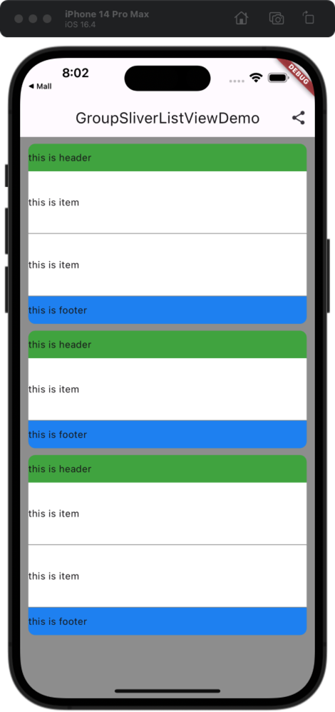

# FlutterGroupListView package for Flutter.
    
### Features
* List Items can be grouped.
* Support ListView、SliverList.
* Support header、footer for each group.
* All fields from `ListView.builder`、`SliverList.builder` constructor available.

## screenshot


## Getting Started

Add the package to your pubspec.yaml:

 ```yaml
 flutter_group_list_view: ^1.0.2
 ```

In your dart file, import the library:

 ```Dart
import 'package:flutter_group_list_view/flutter_group_list_view.dart';
 ``` 

Instead of using a `ListView` create a `GroupListView` Widget:

 ```Dart
List _elements = [
  {
    "storeName": "ASICS Store",
    "storeCode": "s01",
    "goodsList": [{}, {}]
  },
  {
    "storeName": "SALOMON Store",
    "storeCode": "s02",
    "goodsList": [{}]
  },
  {
    "storeName": "ASICS Store",
    "storeCode": "s01",
    "goodsList": [{}, {}]
  }
];

 CustomScrollView(
  slivers: [
    GroupSliverListView(
      sectionCount: _elements.length,
      itemInSectionCount: (int section) {
        return _elements[section]['goodsList'].length;
      },
      headerForSectionBuilder: (int section) {
        return Container(
          height: 40,
          margin: const EdgeInsets.only(left: 12, right: 12, top: 10),
          decoration: const BoxDecoration(
            borderRadius: BorderRadius.only(topLeft: Radius.circular(10), topRight: Radius.circular(10)),
            color: Colors.green,
          ),
          child: const Row(
            children: [Text("this is header")],
          ),
        );
      },
      itemInSectionBuilder: (BuildContext context, IndexPath indexPath) {
        return Container(
          height: 90,
          margin: const EdgeInsets.only(left: 12, right: 12),
          color: Colors.white,
          child: const Row(
            children: [Text("this is item")],
          ),
        );
      },
      separatorBuilder: (IndexPath indexPath) {
        return Container(
          height: 1,
          color: Colors.grey,
        );
      },
      footerForSectionBuilder: (int section) {
        return Container(
          height: 40,
          margin: const EdgeInsets.only(left: 12, right: 12),
          decoration: const BoxDecoration(
            borderRadius: BorderRadius.only(bottomLeft: Radius.circular(10), bottomRight: Radius.circular(10)),
            color: Colors.blue,
          ),
          child: const Row(
            children: [Text("this is footer")],
          ),
        );
      },
    )
  ],
);
```

### Parameters:
* `sectionCount`: The number of sections in the SliverListView. (required)
* `itemInSectionCount`. Function which returns the number of items in a specified section. (required)
* `itemInSectionBuilder`: Function which returns an Widget which defines the item at the specified `IndexPath`. `itemBuilder` provides the current section and index. (required)
```Dart
  itemInSectionBuilder: (BuildContext context, IndexPath indexPath) {
    return Container(
      height: 90,
      margin: const EdgeInsets.only(left: 12, right: 12),
      color: Colors.white,
      child: const Row(
        children: [Text("this is item")],
      ),
    );
  }
```  
* `headerForSectionBuilder`: Function which returns an Widget which defines the section header for each group. (required)
* `separatorBuilder`: Function which returns an Widget which defines the divider/separator at the specified IndexPath.
* `footerForSectionBuilder`: Function which returns an Widget which defines the section footer for each group.